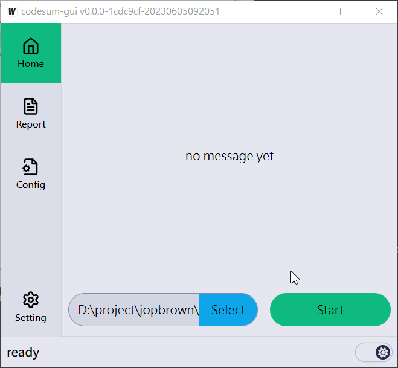
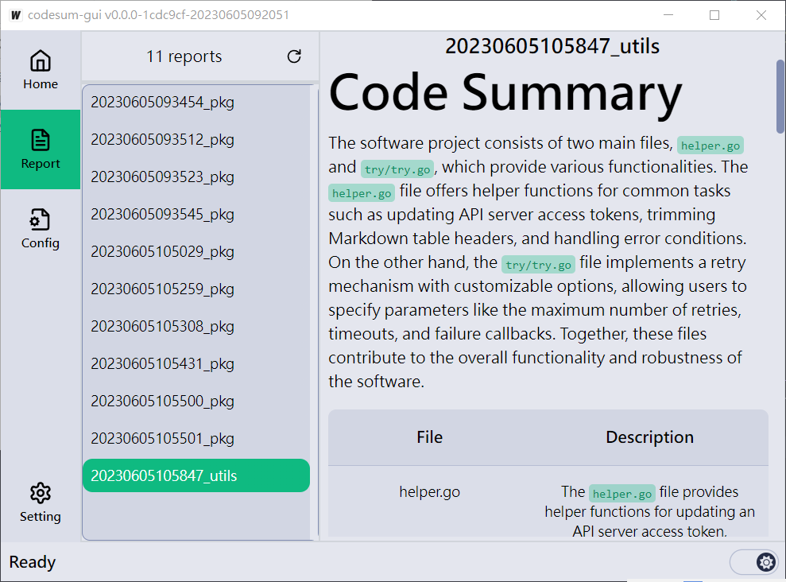
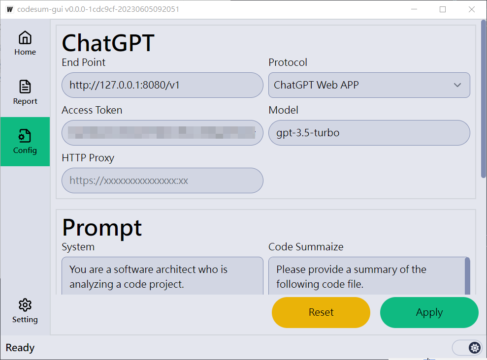
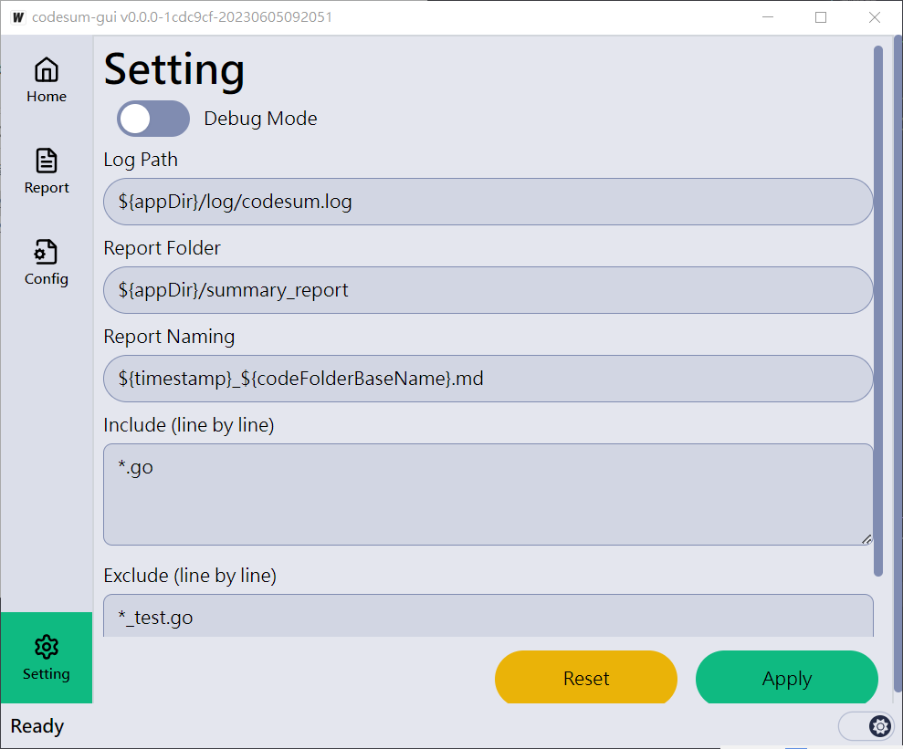

# codesum

This is a code summarization application. It is designed to generate summaries for code files using the ChatGPT model.

The software provides a CLI and GUI tool for users to interact with and configure various aspects of the summarization process, including prompts, rules, and output settings.

## Features

Features document generated by `codesum`.

- [English](./doc/summary_en-US.md)
- [正體中文](./doc/summary_zh_TW.md)

## Usage

### CLI

- install

    ```go
    go install github.com/jopbrown/codesum/cmd/codesum@latest
    ```

- usage

    ```bash
    ./codesum [-c CONFIG_FILE] <CODE_FOLDER>
    ```

### GUI

- prerequisites
    - [Node.js](https://nodejs.org/en/download)
    - [pnpm](https://pnpm.io/installation#using-npm)
    - [wails](https://wails.io/docs/gettingstarted/installation/)

- build

    ```bash
    git clone https://github.com/jopbrown/codesum
    cd codesum/cmd/codesum-gui
    wails build # build/bin/codesum-gui.exe
    ```

- screenshot






### Config

To retrieve environment variables, use the following format: `${env.VARNAME}`.

```yaml
DebugMode: false
LogPath: ${appDir}/log/codesum.log
ChatGpt:
    EndPoint: ${env.CHATGPT_END_POINT}
    APIKey: ${env.CHATGPT_API_KEY}
    AccessToken: ${env.CHATGPT_ACCESS_TOKEN}
    Proxy: ${env.HTTPS_PROXY}
    Model: gpt-3.5-turbo
SummaryRules:
    Include:
        - "*.go"
        - "*.c"
        - "*.cpp"
        - "*.h"
        - "*.js"
        - "*.ts"
        - "*.json"
        - "*.svelte"
        - "*.py"
    Exclude:
        - tmp
        - dist
        - node_modules
    OutDir: ${appDir}/summary_report
    OutFileName: ${timestamp}_${folderBaseName}.md
Prompt:
    System: |
        You are a software architect who is analyzing a code project.
        Now, your are going to summarize the following project file by file.
    CodeSummary: |
        Please provide a summary of the following code file.
        Please focus on the logic of the code.
        Do not explain the imported packages.
        Please answer in the form of a Markdown list.
        The file named "${fileName}" and containing the following code:
        ```
        ${fileContent}
        ```
    SummaryTable: |
        Briefly describe the features of the following files: [${filesCommaList}]
        Put the description in a JSON object as the format `{"{filename}":"{description}"}` .
        Each description should be answered in few sentences.
        Do not add other json fields.
        Do not add other information.
    FinalSummary: |
        Based on the above analyses, summarize the overall features of the software in few sentences.
```
